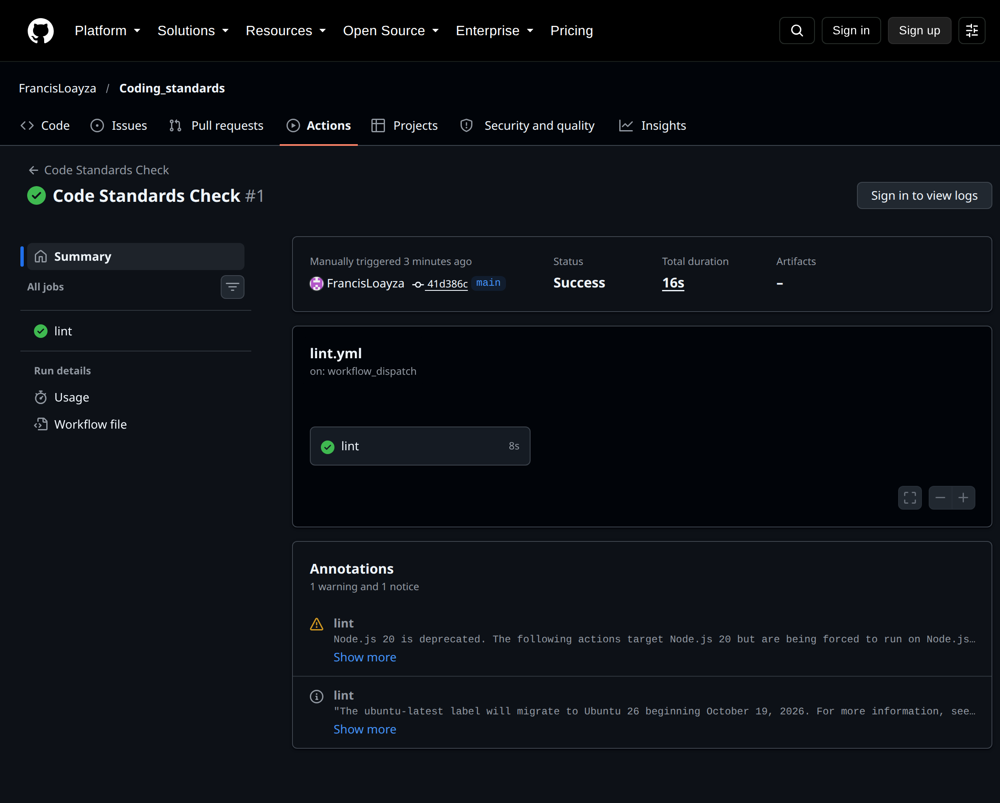
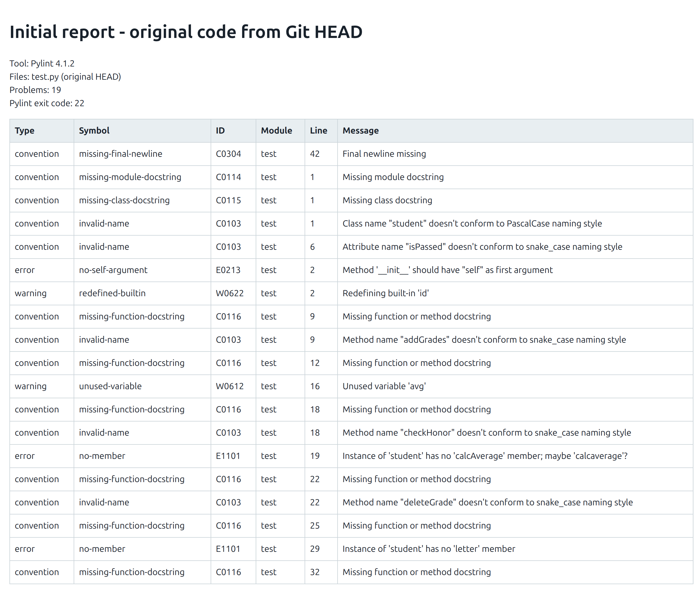
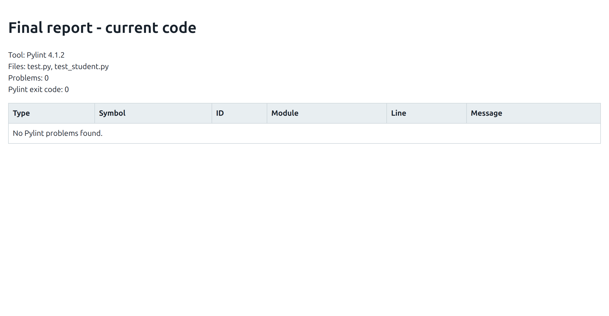

# Informe de laboratorio: estándares de codificación

## Introducción

Elegí Pylint para revisar el código Python porque detecta errores, advertencias y problemas de estilo sin modificar el comportamiento del programa. El repositorio público está disponible en <https://github.com/FrancisLoayza/Coding_standards>.

## Desarrollo

El reporte inicial se generó con Pylint 4.1.2 sobre el `test.py` original, recuperado del commit inicial del repositorio. Encontró 19 problemas y devolvió el código de salida 22. El reporte final revisa `test.py` y `test_student.py`; encontró cero problemas y Pylint calificó el código con 10.00/10.

El programa valida que el nombre y el ID no estén vacíos, acepta notas numéricas entre 0 y 100, calcula promedios y notas en letra, determina el estado Passed/Failed y el cuadro de honor, elimina notas por valor o índice y muestra el resumen requerido. Ante una entrada inválida, muestra un mensaje claro y vuelve al menú en lugar de terminar el programa. Siete pruebas unitarias cubren las reglas principales y los casos de error.

El workflow de GitHub Actions está en `.github/workflows/lint.yml`. Está configurado para pull requests dirigidos a `main` y también permite ejecución manual. El filtro actual limita el trabajo de lint a eventos cuyo actor de GitHub sea `FrancisLoayza`; si la rúbrica exige revisar los pull requests de cualquier colaborador, hay que quitar ese filtro.

La ejecución manual #1 terminó correctamente: el trabajo `lint` finalizó en verde.

[Abrir la ejecución en GitHub](https://github.com/FrancisLoayza/Coding_standards/actions/runs/37810039805)

### Reporte inicial

[Abrir el reporte HTML inicial](pylint-initial.html)

### Reporte final

[Abrir el reporte HTML final](pylint-final.html)

## Conclusiones

El código final cumple los requisitos indicados para el control de notas, pasa las siete pruebas unitarias y no tiene hallazgos de Pylint. Los reportes inicial y final documentan la mejora respecto al código original.

## Recomendaciones

- Confirmar en la pestaña Actions de GitHub que el workflow finaliza correctamente.
- Mantener el filtro de actor solo si la consigna requiere restringir la ejecución a esta cuenta; de lo contrario, quitarlo para revisar todos los pull requests a `main`.
- Agregar capturas de las pruebas y de GitHub Actions si el docente pide evidencia adicional a las capturas de Pylint.